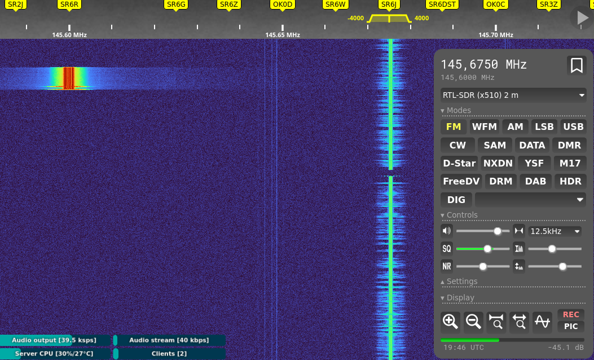

# Poradnik

> [!NOTE]
> Fork poradnika kolegi [SP5EXT](https://github.com/SP5EXT/), zmodyfikowany i uaktualniony przez Filipa SP5FLS w marcu 2025.
> Zachęcam do aktualizacji!

- [Poradnik](#poradnik)
  - [Dwa słowa wstępu](#dwa-słowa-wstępu)
    - [Ile czasu potrzebuję na naukę?](#ile-czasu-potrzebuję-na-naukę)
  - [Nauka](#nauka)
    - [1. Zapisz się na egzamin](#1-zapisz-się-na-egzamin)
    - [2. Podstawy hobby radiowego](#2-podstawy-hobby-radiowego)
    - [3. Testy](#3-testy)
      - [Moje pro-tipy | SP5FLS](#moje-pro-tipy--sp5fls)
    - [4. Część ustna egzaminu - literowanie i kody Q](#4-część-ustna-egzaminu---literowanie-i-kody-q)
  - [Przebieg egzaminu](#przebieg-egzaminu)
    - [2025.03 UKE Warszawa | Filip SP5FLS](#202503-uke-warszawa--filip-sp5fls)
    - [2024 UKE Warszawa | relacja znaleziona w internecie](#2024-uke-warszawa--relacja-znaleziona-w-internecie)
  - [Podsumowanie](#podsumowanie)
    - [Podziękowania](#podziękowania)
    - [Przydatne linki](#przydatne-linki)
    - [Społeczności, YT, Inne](#społeczności-yt-inne)


## Dwa słowa wstępu

Stworzyłem ten krótki poradnik, żeby ułatwić uzyskanie pozwolenia radiowego osobom, które dopiero zaczynają interesować się krótkofalarstwem. 

Często korzystam z darmowych materiałów zrobionych przez innych po godzinach. Ta strona to jedna z moich prób "spłacenia długu" społeczności chcącej dzielić się wiedzą.

Nie jestem ekspertem. Jestem początkującym krótkofalowcem. Egzamin zdałem niecały rok przed utworzeniem tej strony. Istnieje realne prawdopodobnieństwo, że coś gdzieś przekręciłem/źle wytłumaczyłem/wprowadziłem w błąd. 
Jeśli znalazłeś miejsce do poprawy - [otwórz pull request](https://github.com/SP5EXT/egzamin-kf-poradnik) lub napisz do mnie na adres e-mail `hello (at) sp5ext (kropka) pl`. Postaram się dodać poprawki.

Dostępne do pobrania pliki PDF nie są mojego autorstwa - autorzy wymienieni są w owych plikach. Jeśli jesteś autorem któregoś pliku i życzysz sobie jego usunięcia - daj mi znać.


### Ile czasu potrzebuję na naukę?
Egzamin jest dosyć prosty, chociaż nie trywialny i trzeba będzie poświęcić trochę czasu na naukę. W zależności od Twojego obecnego ogarnięcia w temacie techniki/elektroniki będziesz potrzebował łącznie 5-15 godzin. 


## Nauka

### 1. Zapisz się na egzamin

- [Zapisy na egzaminy](https://egzaminy.uke.gov.pl/pl)
- [Informacje ogólne o świadectwach, opłatach](https://bip.uke.gov.pl/swiadectwa-operatora-urzadzen-radiowych-tresci/swiadectwa-amatorskie,3.html)

Serio, to jest pierwszy krok. Wolne miejsca szybko znikają, a zbliżający się termin egzaminu zmotywuje Cię do nauki. Wystarczy usiąść do materiałów 1-2 tygodnie przed wyznaczoną datą, poświęcając na przyswajanie wiedzy 30-60 minut dziennie. Uczenie się w pierwszym kroku, a dopiero potem zapisywanie na egzamin nie ma większego sensu.

### 2. Podstawy hobby radiowego

- [Krakowski Kurs Krótkofalarski](https://www.youtube.com/watch?v=Wo2Zof96vjM&list=PLziQLnE44RtWN2jaay-1BDeQ0eAkkuuJi)
- [Radio FAQ](./files/radio_faq1.pdf)


Zaczynamy od [nagrań krakowskiego kursu krótkofalarskiego](https://www.youtube.com/watch?v=Wo2Zof96vjM&list=PLziQLnE44RtWN2jaay-1BDeQ0eAkkuuJi).

Kurs jest długi i oglądanie wszystkich odcinków dla osoby która jest "zielona" może być dużym wyzwaniem, może wręcz zniechęcać.
Dlatego moja rada - **zmuś się i obejrzyj pierwsze dwie części** ([Odcinek 0](https://www.youtube.com/watch?v=Wo2Zof96vjM), [Odcinek 1](https://www.youtube.com/watch?v=g3wyVkh-x3Q)).

Przejrzyj też [Radio FAQ](./files/radio_faq1.pdf).
Resztę odcinków obejrzyj w miarę chęci.

Przedstawiona w filmach wiedza z początku może wydać Ci się trudna do przyswojenia, wręcz abstrakcyjna. Nie przejmuj się, wszystko z czasem ułoży się w głowie. Jest to kurs robiony amatorsko i prowadzący mieszają czasami proste, podstawowe zagadnienia z tymi złożonymi.

Mimo tych niedogodności zawsze będę kibicował autorom kursu - poświęcili swój prywatny czas żeby przekazać ogrom wiedzy za darmo 👍


### 3. Testy

- [Testy SP6DLV](https://test.sp6dlv.pl/) 
- [egzaminkf.pl - źródło pomocnicze](http://www.egzaminkf.pl/home.php)
- [Schematy blokowe - ściąga](./files/schematyblokowe-ver2.pdf)
- [Bandplan, literowanie, kody Q](./files/literowanie_bandplan.pdf)


Kolejnym krokiem jest mielenie testów. Jako osoba przechodząca kiedyś egzamin na patent strzelecki, posłużę się porównaniem - baza pytań do egzaminu KF jest mniejsza, prostsza, a przede wszystkim jawna.
Nie oznacza to jednak, że jest ona niezmienna. Dla świętego spokoju przejrzyj aktualną listę kilka dni przed egzaminem.

Część testowa egzaminu zawiera 20 pytań podzielonych na 4 sekcje. Aby zdać egzamin wystarczy odpowiedzieć poprawnie na 3 z 5 pytań w każdej z nich (czyli łącznie na 60% pytań).

**Jak to opanować:**

- Rozwiązuj te testy codziennie przez kilka dni aż średni wynik będzie oscylował w okolicach minimum 90%. 
- Platforma SP6DLV umożliwia oznaczanie trudnych pytań i wałkowanie ich do upadłego. Korzystaj z tej funkcji.
- Do nauki schematów blokowych i częstotliwości użyj dedykowanych materiałów. Każdy znajduje sobie klucz wg którego zapamiętuje tego typu wiedzę.
- Czas egzaminu to 20 minut, ale dobrze przygotowana osoba odpowiada na wszystkie pytania w 2 minuty.


#### Moje pro-tipy | SP5FLS

> [!TIP]
> tl;dr robić testy

- robić testy
- robić testy
- robić testy; dla trudniejszych odpowiedzi robiłem notatki na papierze
- ćwiczenie literowania ICAO przy każdej okazji (literowanie rejestracji samochodów, nazw sklepów itp)
- bardzo dobrze sprawdziła mi się nauka z LLMami. Korzystałem z ChatGPT (4o, darmowa), Mistral (darmowa) i Claude (pro). W Calude utworzyłem projekt, gdzie wgrałem cały pdf z pytaniami od UKE. Potem robiąc testy, gdy czegoś nie rozumiałem, zadawałem pytania w tym projekcie a model dawał odpowiedź już w kontekście egzaminu. Modele świetnie sprawdziły się w tłumaczeniu obliczeń i wzorów, wykonywaniu samych obliczeń oraz tłumaczeniu praw fizyczno-elektrycznych ;-) Pamiętaj jednak zawsze skonfrontować odpowiedź modleu ze zdrowym rozsądkiem i prawidłową odpowiedzią testu ;)
  - przykładowe zapytanie do Claude z odpowiedziami [znajdziesz tutaj](claude.md)
- literowanie ćwiczyłem na takich zestawach, w każej linii jest każda litera (z powtórzeniami) więc jedna linijka pozwala na przećwiczenie wszystkich liter:

```
JVKLS QNZDH CTSKD JEWYO QJGLH IQXAM FRBAY OPLUO
GFNSQ TRWPV FBYSU XYXZY EIDJM COWJF KCCNA HLEDL
ABWYE GHCJP HBFJU LTOLZ UCKDQ IJVKM QUGPS XNRID
JPRPN XYGSQ GKDUP QDEPA WWZHO BTVGL DZMXF TEUIC
IVDEJ QIACF FEBPR GLCKS UCZME MTRWH AGXNY BTRRO
SPTPM QJWRZ QEBVU ONKSX XMGJC GDLFB TIBTH AYVBU
CQFZO GARPB VADNU YILWT MNHQJ FXVTG YRHQK SZRKE
FAVJN QOWDP XKOZP HYCIF SLWMG BUKIT EHRKA EKHJW
LKYOP CCANL ZFALC FDZWU YKGSR IQQRI BJMTQ VXEHX
NVUCK UWSFT FHQJX ZYJRY BNLTB BPTAA QOJEG DMYTI
```
- Pobawić się nasłuchem: albo skanerem / SDR, albo wygodniej przez WebSDR, [lista polskich serwerów](https://sierraecho.pl/websdr-wykaz-serwerow-w-polsce/) - poszukać przemienników.
  - Jeden, to posłuchanie prawdziwych rozmów w eterze, jak nawiązywana jest łączność, jak używane są kody Q itp.
  - Dwa, to poklikać w przyciski w WebSDR - zmienić modulacje, LSB/USB, WFM - to pozwoli *w praktyce* oswoić się z częstotliwościami, zakresami itp.




### 4. Część ustna egzaminu - literowanie i kody Q

- [Radio FAQ](./files/radio_faq1.pdf) 
- [Bandplan, literowanie, kody Q](./files/literowanie_bandplan.pdf)
- [Przykładowa symulowana łączność](https://www.youtube.com/watch?v=YrdKml_QX48)

Po zaliczeniu części pisemnej i sprawdzeniu wyników, jesteśmy zaproszeni na krótki (3-5 minut) egzamin ustny na osobności (patrz niżej: świeże opisy egzaminu)

Na początku egzaminu losujemy zestaw pytań. W ramach wszystkich zestawów podczas mojej sesji trzeba było:

- przeliterować dwa znaki. Jeden po polsku, drugi po angielsku
- rozszyfrować znaczenie podanego kodu Q
- odgadnąć jakim kodem Q można określić podaną wiadomość
- przeprowadzić symulację łączności (*ostatnio brak - patrz niżej*)

**Literowanie**

Tutaj na wstępie mała uwaga mająca wpływ na przebieg egzaminu. O ile przy literowaniu po polsku panuje dowolność, o tyle podczas literowania po angielsku trzeba się ściśle trzymać schematu. 
Zarówno w sieci jak i w eterze spotkasz się z tym, że dla litery T niektórzy literują "Tomasz" lub "Tadeusz", a dla X "Ksawery" lub "Ksantypa".

**Jak się nauczyć** napisz dwa-trzy losowe zdania i staraj się je przeliterować w obu alfabetach. Jeśli wybitnie nie idzie (mi nie szło), to literuj na początku na piśmie. Pisanie angażuje więcej neuronów i ułatwia zapamiętywanie.

Alternatywnym sposobem nauki jest literowanie tablic rejestracyjnych mijanych pojazdów.

**Kody Q**

Kody służą przyśpieszeniu i ułatwieniu komunikacji. Niestety, tu nie ma że boli. Są kody, które są stosowane bardzo często (QSO, QTH, QSY), jak i te bardzo rzadkie. Rzucając okiem na zestawy dostępne podczas mojego egzaminu miałem wrażenie, że komisja wybrała raczej te popularniejsze pozycje, ale nie mogę tego zagwarantować.

**Jak się nauczyć** w większości kodów Q nie ma zbyt wiele logiki i schematów. Na początku o tym nie wiedziałem i próbowałem te schematy znaleźć, rozpisując je w zeszycie i kreśląc połączenia, porównania. Myślę, że to mi najbardziej pomogło w nauce :) 


**Symulacja łączności**

Niektórzy egzaminatorzy to uskuteczniają, niektórzy nie. Oczywistym jest to, że oficjalnie osobie bez pozwolenia nie wolno nawiązywać łączności, stąd wymaganie tej umiejętności na egzaminie jest sztuczne.

Na szczęście ten nieco żenujący spektakl trwa krótko - schemat znajdziesz w dołączonym FAQ w PDF na piątej stronie. 

Możesz też spojrzeć na [kalendarz zawodów KF](https://sp9cxn.pzk.pl/kalendarz.html) i posłuchać transmisji uczestników. Nie potrzebujesz do tego radia. Transmisji możesz słuchać przez [WebSDR](http://sierraecho.pl/websdr-wykaz-serwerow-w-polsce/).


## Przebieg egzaminu

### 2025.03 UKE Warszawa | Filip SP5FLS

> [!TIP]
> Zdawałem egzamin w marcu 2025 w UKE w Warszawie

- Egzaminy były na godz. 16 i 17, na oba terminy było po 16 osób
- Zdający na każdą godzinę zostali podzieleni na 2 podgrupy po 8 osób - tyle jest laptopów w sali egzaminacyjnej
- Po wyklikaniu egzaminu teoretycznego i zatwierdzeniu, pani sekretarka czekająca przed salą ma już wyniki. Jeśli wynik pisemnego jest pozytywny to od razu po wyjściu z sali proszą na egzamin ustny
- Na pisemnym nie potrzeba kartki, długopisu i kalkulatora - mam wrażenie, że pytania są tak dobrane, żeby dało się policzyć w pamięci. Ja miałem jedno pytanie o decybele i prąd, ale to można było policzyć w pamięci lub na palcach
- pytania były z bazy i tego co zrobili koledzy na http://www.egzaminkf.pl/home.php i https://test.sp6dlv.pl/#test (bardzo dziękujemy - to jest mega pomocne), chociaż ja miałem dwa pytania których nie widziałem wcześniej (ale odpowiedzi chyba dość intuicyjne); inni zdający mówili że mieli dokładne pytania z bazy; kolejność pytań była inna niż w odpowiedziach w bazie (jakby ktoś chciał się nauczyć odpowiedzi na pamięć ;-) )
- ważne żeby zapisać sobie (np w telefonie) hasło do portalu "egzaminy" i sprawdzić czy działa; na naszej turze jeden kolega nie mógl się zalogować i to trochę opóźniło rozpoczęcie dla całej grupy. Na miejscu jest pan który w razie czego resetuje hasło, ale lepiej pamiętać swoje hasło od razu :)
- egzamin ustny: ja miałem: kody Q - ze 4-5 i to tych dość prostych (QTH, QRM, QSO, QSL, QRT czy podobne) - w obie strony, literowanie znaku po angielsku (jeden znak SP, ale słyszałem że jak słabo szło to pytają o więcej), dwa pytania teoretyczne - co to jest znak wywoławczy i jedno którego nie pamiętam i to tyle. Inni koledzy mieli pytania o raport RS - co znaczy 43 i w drugą stornę. Nie było symulowanej łączności. Całość trwa może dwie minuty, w tym połowa to podpisy na dokumentach i gratulacje ;-)
- "wizualna" statystyka dwóch sesji (czyli 2x16 osób) była taka że większośc zdała, ok 3 osoby nie
- wszystko przebiega raczej w luźnej atmosferze, egzaminatorzy życzliwi i na luzie

### 2024 UKE Warszawa | relacja znaleziona w internecie

Po przyjściu na umówioną godzinę (byliśmy 10minut wcześniej, około 10 osób) pan egzaminator zapytał czy chcemy zacząć wcześniej, wszyscy się zgodzili więc przed salą musieliśmy pokazać dowód tożsamości i podpisać się ze jesteśmy.
W sali były laptopy na co drugim miejscu, każdy miał się zalogować na swoje konto w egzaminy.uke.gov.pl (można było z komórki sobie spisać hasło jak ktoś nie pamiętał). Pan wyjaśnił zasady egzaminu i jak go używać.
Uczyłem się ze strony egzaminkf.pl i pytania były dokładnie takie same, odpowiedzi były w różnych kolejnościach.
Po egzaminie mieliśmy się wylogować i poczekać na korytarzu. W tym czasie komisja drukowała wyniki egzaminu pisemnego i zaczęła zapraszać na egzamin praktyczny.
Egzamin prowadzili 3 egzaminatorzy ale każdy po jednej osobie więc szło szybko. Nie było losowania kart. egzaminator na kartce napisał trzy znaki które musiałem przeliterować w ICAO (wyłącznie po angielsku), następnie byłem pytany z kodów Q w dwie strony, czyli jaki znak oznacza zakłócenia z innych stacji, albo co znaczy QTH. Na końcu dwa pytania o raport łączności, czyli co oznacza 5 9 9 a drugi odwrotnie czyli jaka liczba oznacza czytelny z trudnościami itd.
Egzaminator zerknął na moje wyniki egzaminu pisemnego, powiedział że otrzymuje wynik pozytywny i podpisał mi zaświadczenie o zdaniu egzaminu (teraz nie ma już świadectw radioamamtorskich), przesłałem do UKE wniosek o wydanie pozwolenia i czekam, juz będzie koło 3 tygodni, wniosek wysyłałem przez PUE UKE.
1. Do egzaminu uczyłem się niecałe 2 tygodnie, wcześniej nie miałem styczności z KF.
2. Robiłem 20-30 testów dziennie i powtarzałem kody Q i alfabet każdego dnia.
3. Największe trudności miałem z nauczeniem się części elektronicznej/budowy radia, według mnie połowa pytań w obecnych czasach jest do wywalenia.

## Podsumowanie

Jeśli tak jak ja kiedyś nigdy nie marzyłeś o tym hobby, ale jakimś cudem w Twoim domu znalazł się Baofeng i uznałeś, że trzeba się nauczyć go używać, to jest duża szansa, że pierwsze zderzenie z światem krótkofalarskim będzie dla Ciebie podobne do zderzenia ze ścianą ;)

Z perspektywy czasu, mimo że nie jest to moje główne hobby, uważam że warto było się odrobinę przymusić, nauczyć i zdać. W pewnym momencie wiedza zaczyna wchodzić całkiem łatwo, a miło czasami móc wieczorem odpalić nawet najtańsze radio i coś sobie posłuchać lub nadać. Jeszcze milej jest wiedzieć, jak go poprawnie użyć.

Powodzenia!

### Podziękowania

Podziękowania dla kolegi SQ9NOX za recenzję i kilka uwag, pomysłów.


### Przydatne linki

Niektóre linki powtarzają się w sekcjach wyżej dla Twojej wygody (mam nadzieję ;).

**Wybrane filmy**

- [KF Kontra złośliwe trolle (ten film zainspirował mnie do wzięcia się za to hobby)](https://www.youtube.com/watch?v=SP-UN8r7WGQ)
- [Opis egzaminu KF w wykonaniu Sierra Echo](https://www.youtube.com/watch?v=biO8y8Z5o8E)
- [Portal SQ9JDO - kopalnia wiedzy](http://sq9jdo.com.pl/indeks.html)

### Społeczności, YT, Inne

- [Przemienniki.net](https://przemienniki.net/)
- [Mapa nadajników komercyjnych](https://nadajniki.yasiu.pl/)
- [Zapisy na egzaminy](https://egzaminy.uke.gov.pl/pl)
- [Informacje ogólne o świadectwach, opłatach](https://bip.uke.gov.pl/swiadectwa-operatora-urzadzen-radiowych-tresci/swiadectwa-amatorskie,3.html)
- [Grupa krótkofalarska na Facebooku](https://www.facebook.com/groups/168674173954605)
- [Społeczność krótkofalarska na Discord](https://discord.gg/krotkofalarstwo-958356886896386088)
- [Kanał Sierra Echo na YouTube - dużo praktycznej wiedzy, częste live'y](https://www.youtube.com/c/SierraEcho)
- [Lista serwerów WebSDR w Polsce](http://sierraecho.pl/websdr-wykaz-serwerow-w-polsce/)
- [Kalendarz zawodów KF](https://sp9cxn.pzk.pl/kalendarz.html)

